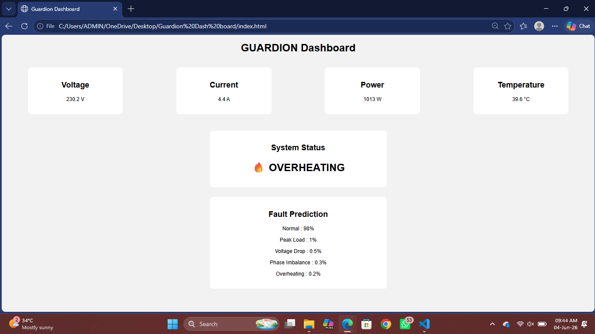

# Guardion Dashboard

Edge AI-Based Smart Electrical Fault Detection Dashboard

## Overview

Guardion is a smart electrical monitoring system designed to detect:

- Voltage Drop
- Peak Load
- Overheating
- Phase Imbalance
- Normal Operating Conditions

The dashboard visualizes real-time electrical parameters and fault predictions.

## Dashboard Preview

## Features

- Live Voltage Monitoring
- Live Current Monitoring
- Power Calculation
- Temperature Monitoring
- Real-Time Fault Detection
- Smart Status Indicators

## Technologies Used

- HTML
- CSS
- JavaScript
- Git
- GitHub

## Future Improvements

- FPGA Integration
- Edge AI Inference
- Real-Time Charts
- Alert Notifications
- Cloud Synchronization

## Project Team

- Dhayas Sri R
- Pooja Sree J R

Department of Electrical and Electronics Engineering